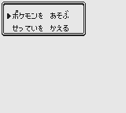

# This is a fork of the [**Pokémon Gold Spaceworld 1997 Demo**][pokegold] disassembly.

The aim is to restore as much content in the demo as possible.

<!-- TABLE OF CONTENTS -->

  
<h2 style="display: inline-block">Table of Contents</h2>

  <ol>
    <li>
     <a href="#minimal_story_mode">Enabled Minimal Story Mode</a>
      <ul>
        <li><a href="#built-with">Built With</a></li>
      </ul>
    </li>
    <li>
      <a href="#getting-started">Getting Started</a>
      <ul>
        <li><a href="#prerequisites">Prerequisites</a></li>
        <li><a href="#installation">Installation</a></li>
      </ul>
    </li>
    <li><a href="#usage">Usage</a></li>
    <li><a href="#roadmap">Roadmap</a></li>
    <li><a href="#contributing">Contributing</a></li>
    <li><a href="#license">License</a></li>
    <li><a href="#contact">Contact</a></li>
    <li><a href="#acknowledgements">Acknowledgements</a></li>
  </ol>

Enabled minimal story mode
 
 &nbsp;  &nbsp; 
 
 &nbsp; &nbsp;
 
 &nbsp;  &nbsp;
 
 &nbsp;

# Pokémon Gold and Silver: Space World 1997 Demo [![Build Status][travis-badge]][travis]

This is a work-in-progress disassembly of the Pokémon Gold and Pokémon Silver prototypes demoed at Space World 1997.

It builds the following ROMs:

- Gold_debug.sgb `sha1: b1d7539a87dea81b2cff6146afaad64470d08d84`
- Gold_debug.sgb (correct header) `sha1: 87fd8dbe5db39619529abcfc99e74cc5ecb8b94e`

You will need to provide a copy of Gold_debug.sgb renamed **baserom.gb** to build the ROMs.

## See also

- **Discord:** [pret][discord]
- **IRC:** [freenode#pret][irc]

Other disassembly projects:

- [**Pokémon Red/Blue**][pokered]
- [**Pokémon Yellow**][pokeyellow]
- [**Pokémon Gold**][pokegold]
- [**Pokémon Crystal**][pokecrystal]
- [**Pokémon Pinball**][pokepinball]
- [**Pokémon TCG**][poketcg]
- [**Pokémon Ruby**][pokeruby]
- [**Pokémon FireRed**][pokefirered]
- [**Pokémon Emerald**][pokeemerald]

[pokered]: https://github.com/pret/pokered
[pokeyellow]: https://github.com/pret/pokeyellow
[pokegold]: https://github.com/pret/pokegold
[pokecrystal]: https://github.com/pret/pokecrystal
[pokepinball]: https://github.com/pret/pokepinball
[poketcg]: https://github.com/pret/poketcg
[pokeruby]: https://github.com/pret/pokeruby
[pokefirered]: https://github.com/pret/pokefirered
[pokeemerald]: https://github.com/pret/pokeemerald
[discord]: https://discord.gg/d5dubZ3
[irc]: https://kiwiirc.com/client/irc.freenode.net/?#pret
[travis]: https://travis-ci.org/pret/pokegold-spaceworld
[travis-badge]: https://travis-ci.org/pret/pokegold-spaceworld.svg?branch=master
[pokegold]: https://github.com/pret/pokegold-spaceworld