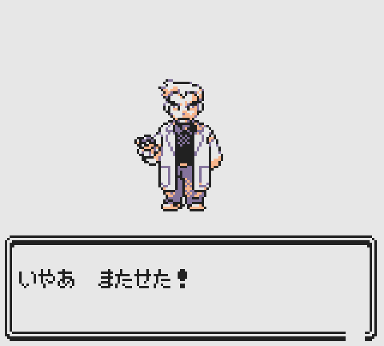

# This is a fork of the [**Pokémon Gold Spaceworld 1997 Demo**][pokegold] disassembly.

The aim is to restore as much content in the demo as possible. It builds the following ROMs:

- Gold_debug.sgb `sha1: b1d7539a87dea81b2cff6146afaad64470d08d84`
- Gold_debug.sgb (correct header) `sha1: 87fd8dbe5db39619529abcfc99e74cc5ecb8b94e`

You will need to provide a copy of Gold_debug.sgb renamed **baserom.gb** to build the ROMs.

[pokegold]: https://github.com/pret/pokegold-spaceworld

<!-- TABLE OF CONTENTS -->

  
<h2 style="display: inline-block">Table of Contents</h2>

  <ol>
    <li>
     <a href="#minimal_story_mode">Enabled Minimal Story Mode</a>
      <ul>
        <li><a href="#built-with">Built With</a></li>
      </ul>
    </li>
    <li>
      <a href="#getting-started">Getting Started</a>
      <ul>
        <li><a href="#prerequisites">Prerequisites</a></li>
        <li><a href="#installation">Installation</a></li>
      </ul>
    </li>
    <li><a href="#usage">Usage</a></li>
    <li><a href="#roadmap">Roadmap</a></li>
    <li><a href="#contributing">Contributing</a></li>
    <li><a href="#license">License</a></li>
    <li><a href="#contact">Contact</a></li>
    <li><a href="#acknowledgements">Acknowledgements</a></li>
  </ol>

<h1><a href="https://github.com/eisnerguy1/pokegold-spaceworld-restore/commit/49410368d68fd22434da73e8bbf02d48516d6d61">Enabled minimal story mode</a></h1>
 
<table>
  <tr>
    <td> </td> 
    <td> </td> 
    <td> </td> 
  </tr> 
  
   <tr>
    <td> </td> 
    <td> </td> 
    <td> </td> 
  </tr> 
     <tr>
    <td> </td> 
  </tr> 
  
</table> 