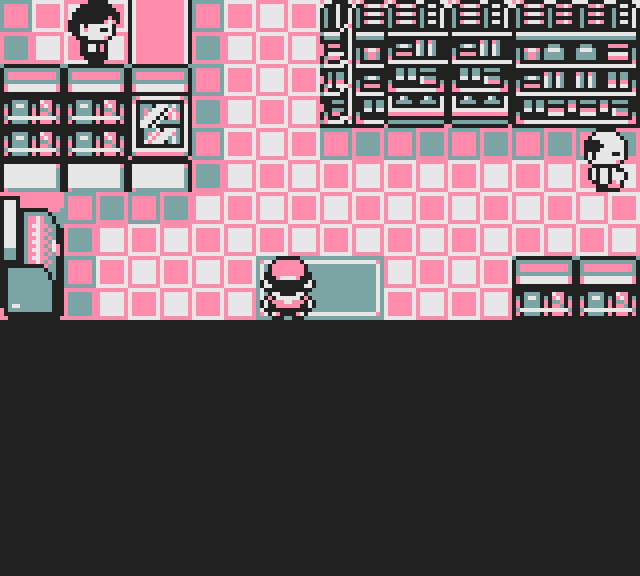

# This is a fork of the [**Pokémon Gold Spaceworld 1997 Demo**][pokegold] disassembly.

The aim is to restore as much content in the demo as possible. It builds the following ROMs:

- Gold_debug.sgb `sha1: b1d7539a87dea81b2cff6146afaad64470d08d84`
- Gold_debug.sgb (correct header) `sha1: 87fd8dbe5db39619529abcfc99e74cc5ecb8b94e`

You will need to provide a copy of Gold_debug.sgb renamed **baserom.gb** to build the ROMs.

[pokegold]: https://github.com/pret/pokegold-spaceworld

<!-- TABLE OF CONTENTS -->
  
<h2 style="display: inline-block">Table of Contents</h2>

  <ol>
    <li>
     <a href="#minimal_story_mode">Enabled Minimal Story Mode</a>
  </li>
  <li>
    <a href="#rival_battle">Fixed Rival battle in minimal story mode</a>
    </li>
    <li>
    <a href="#pokemart_widths">Fixed PokeMart widths</a>
    </li> 
      <li>
    <a href="evolutions">Restored Disabled Evolutions</a>
    </li> 
  </ol>
 

<h2><a href="https://github.com/eisnerguy1/pokegold-spaceworld-restore/commit/49410368d68fd22434da73e8bbf02d48516d6d61">Enabled minimal story mode </a></h2>
<table style="border-spacing: 100px;">
  <tr>
    <td width="320" height="288"></td>
    <td width="320" height="288"> </td> 
    <td width="320" height="288"> </td>
  </tr> 
  
   <tr>
     <td width="320" height="288"> </td>
     <td width="320" height="288"> </td>
     <td width="320" height="288"> </td>
  </tr> 
     <tr>
     <td width="320" height="288"> </td>
  </tr> 
</table>

<h2><a href="https://github.com/eisnerguy1/pokegold-spaceworld-restore/commit/49410368d68fd22434da73e8bbf02d48516d6d61">Fixed Rival battle in minimal story mode </a></h2>
<table>
  <tr>
        <td width="320" height="288"> </td> 
        <td width="320" height="288"> </td> 
        <td width="320" height="288"> </td>
      </tr>
    <tr>
        <td width="320" height="288"> </td> 
  </tr> 
</table>

<h2><a href="https://github.com/eisnerguy1/pokegold-spaceworld-restore/commit/538bef1988b1a43f24857db20f52152b3b2714b8">Fixed PokéMart widths</a></h2>
<table>
  <tr>
        <td width="384"> </td> 
        <td width="512"> </td> 
      </tr>
  </table>
  <table>
    <tr>
        <td width="320" height="288"> </td> 
        <td width="320" height="288"> </td> 
        <td width="320" height="288"> </td> 
  </tr>
    <tr>
        <td width="320" height="288"> </td> 
        <td width="320" height="288"> </td> 
        <td width="320" height="288"> </td> 
  </tr> 
  <tr>
        <td width="320" height="288"> </td> 
        <td width="320" height="288"> </td> 
        <td width="320" height="288"> </td> 
  </tr>
</table>

<h2><a href="https://github.com/eisnerguy1/pokegold-spaceworld-restore/commit/e0abfe6db4f4ce4061f80d196883f4f6998221d2">Restored Disabled Evolutions </a></h2>
<table>
  <tr>
        <td width="320" height="288"> </td> 
        <td width="320" height="288"> </td> 
      </tr>
 
  <tr>
        <td width="320" height="288"> </td> 
        <td width="320" height="288"> </td> 
      </tr>
        <tr>
        <td width="320" height="288"> </td> 
        <td width="320" height="288"> </td> 
      </tr>
      <tr>
        <td width="320" height="288"> </td> 
        <td width="320" height="288"> </td> 
      </tr>
        <tr>
        <td width="320" height="288"> </td> 
        <td width="320" height="288"> </td> 
      </tr>
    <tr>
        <td width="320" height="288"> </td> 
        <td width="320" height="288"> </td> 
      </tr>
          <tr>
        <td width="320" height="288"> </td> 
        <td width="320" height="288"> </td> 
      </tr>
          <tr>
        <td width="320" height="288"> </td> 
        <td width="320" height="288"> </td> 
      </tr>
          <tr>
        <td width="320" height="288"> </td> 
        <td width="320" height="288"> </td> 
      </tr>
                <tr>
        <td width="320" height="288"> </td> 
        <td width="320" height="288"> </td> 
      </tr>
                <tr>
        <td width="320" height="288"> </td> 
        <td width="320" height="288"> </td> 
      </tr>
                      <tr>
        <td width="320" height="288"> </td> 
        <td width="320" height="288"> </td> 
      </tr>
                            <tr>
        <td width="320" height="288"> </td> 
        <td width="320" height="288"> </td> 
      </tr>
                            <tr>
        <td width="320" height="288"> </td> 
        <td width="320" height="288"> </td> 
      </tr>
</table>

Heart Stone & Poison Stone doen't work for some reason.   I'm still <a href="https://pastebin.com/7m0eeRh3">looking into</a> why they don't work.

<b>Heart Stone Evolutions</b>
<table>
     <tr>
        <td width="112"> </td> 
        <td width="112"> </td> 
      </tr>
       <tr>
        <td width="112"> </td> 
        <td width="112"> </td> 
      </tr>
         <tr>
        <td width="112"> </td> 
        <td width="112"> </td> 
      </tr>
</table>

<b>Poison Stone Evolutions</b>
<table>
     <tr>
        <td width="112"> </td> 
        <td width="112"> </td> 
      </tr>
       <tr>
        <td width="112"> </td> 
        <td width="112"> </td> 
      </tr>
         <tr>
        <td width="112"> </td> 
        <td width="112"> </td> 
      </tr>
</table>