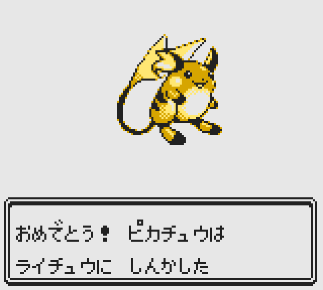
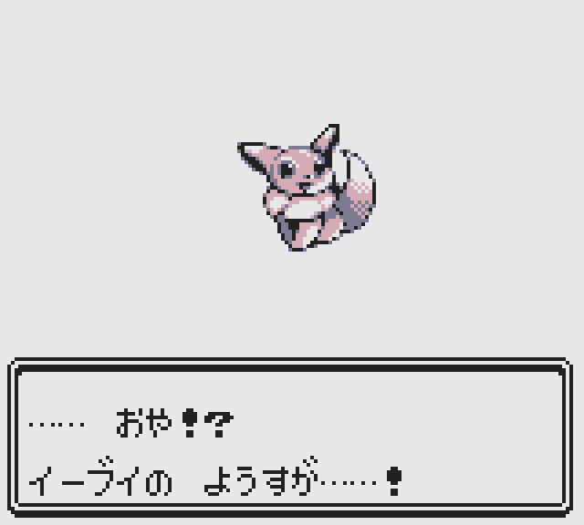
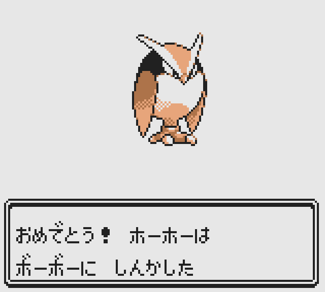
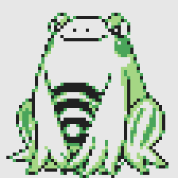
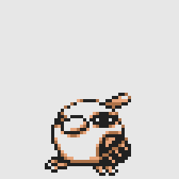
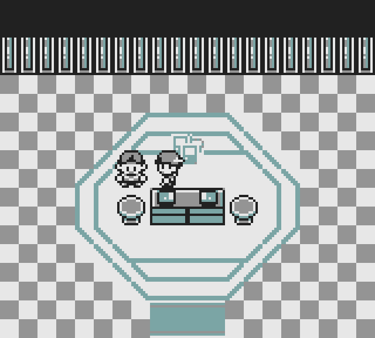

# This is a fork of the [**Pokémon Gold Spaceworld 1997 Demo**][pokegold] disassembly.

The aim is to restore as much content in the demo as possible. For more information about the Spaceworld 1997 demo, check out the article on tcrf:
 
[Proto:Pokémon Gold and Silver/Spaceworld 1997 Demo](https://tcrf.net/Proto:Pokémon_Gold_and_Silver/Spaceworld_1997_Demo)
  
It builds the following ROMs:

- Gold_debug.sgb `sha1: (None yet)`
- Gold_debug.sgb (correct header) `sha1: (None yet)`

You will need to provide a copy of Gold_debug.sgb renamed **baserom.gb** to build the ROMs.  [Thanks to Polished Map](https://github.com/Rangi42/polished-map) for allowing me to correct the collision data and other issues with ease.

[pokegold]: https://github.com/pret/pokegold-spaceworld

<!-- TABLE OF CONTENTS -->
  
<h2 style="display: inline-block">Table of Contents</h2>

  <ol>
    <li>
     <a href="#to-do">Things to work on</a>
  </li>
<li>
     <a href="#minimal_story_mode">Enabled Minimal Story Mode</a>
  </li>
  <li>
    <a href="#rival_battle">Fixed Rival battle in minimal story mode</a>
    </li>
    <li>
    <a href="#pokemart_widths">Fixed PokeMart widths</a>
    </li> 
      <li>
    <a href="#evolutions">Restored Disabled Evolutions</a>
    </li> 
        <li>
    <a href="#rival_end_demo">Moved the Rival at end of demo</a>
    </li> 
          <li>
    <a href="#gate">Correct collision data for the Gate buildings & Pkmn Center Battle & Trade rooms</a>
    </li>
            <li>
    <a href="#pokemart">Correct collision data for the PokéMart interior</a>
    </li>
  </ol>
  
 

 

<h2>Things to work on</h2>
                
- [ ] Correct collision data for all of the towns
- [ ] Correct tall grass collision data
- [ ] Correct collision data for water
- [ ] Have fully functional 2F in all Pokémon Centers?
- [ ] Change end of game (when out of usable Pokémon) to having your party auto-healed and the game continues
- [ ] Fix Heart Stone & Poison Stone
- [ ] Verify that maps seamlessly connect?  If not, correct them?
- [ ] Fix Pokémon Storage?  Use Field Debug Menu item?
- [ ] Enable PokéMart? Field Debug Menu item?
- [ ] Enable Pikachu & Sunflora's send out animation for all shiny Pokémon and give those 2 Pokémon the default send out animation
- [ ] add stairs up for schools -> Gym: old
- [ ] add stairs down for gyms -> school: all
- [ ] remove school floor and lead directly to gym instead?  
- [ ] Give the starter Pokémon a berry to hold like in the final GSC?    
- [ ] Add missing buildings for Prince
- [ ] Fix Trading palette issues       
 

<h2><a href="https://github.com/eisnerguy1/pokegold-spaceworld-restore/commit/49410368d68fd22434da73e8bbf02d48516d6d61">Enabled minimal story mode </a></h2>
<table>
  <tr>
    <td width="320" height="288"> </td>
    <td width="320" height="288"> </td> 
    <td width="320" height="288"> </td>
  </tr> 
  
   <tr>
     <td width="320" height="288"> </td>
     <td width="320" height="288"> </td>
     <td width="320" height="288"> </td>
  </tr> 
     <tr>
     <td width="320" height="288"> </td>
  </tr> 
</table>

<h2><a href="https://github.com/eisnerguy1/pokegold-spaceworld-restore/commit/971fd4f10ffccc18d2869dba3c4c5fe77d3e56aa">Fixed Rival battle in minimal story mode </a></h2>
<table>
  <tr>
        <td width="320" height="288"> </td> 
        <td width="320" height="288"> </td> 
        <td width="320" height="288"> </td>
      </tr>
    <tr>
        <td width="320" height="288"> </td> 
  </tr> 
</table>

<h2><a href="https://github.com/eisnerguy1/pokegold-spaceworld-restore/commit/538bef1988b1a43f24857db20f52152b3b2714b8">Fixed PokéMart widths</a></h2>
<table>
  <tr>
        <td width="384"> </td> 
        <td width="512"> </td> 
      </tr>
  </table>
  <table>
    <tr>
        <td width="320" height="288"> </td> 
        <td width="320" height="288"> </td> 
        <td width="320" height="288"> </td> 
  </tr>
    <tr>
        <td width="320" height="288"> </td> 
        <td width="320" height="288"> </td> 
        <td width="320" height="288"> </td> 
  </tr> 
  <tr>
        <td width="320" height="288"> </td> 
        <td width="320" height="288"> </td> 
        <td width="320" height="288"> </td> 
  </tr>
</table>

<h2><a href="https://github.com/eisnerguy1/pokegold-spaceworld-restore/commit/e0abfe6db4f4ce4061f80d196883f4f6998221d2">Restored Disabled Evolutions</a></h2>
<table>
  <tr>
        <td width="320" height="288"> </td> 
        <td width="320" height="288"> </td> 
      </tr>
 
  <tr>
        <td width="320" height="288"> </td> 
        <td width="320" height="288"> </td> 
      </tr>
        <tr>
        <td width="320" height="288"> </td> 
        <td width="320" height="288"> </td> 
      </tr>
      <tr>
        <td width="320" height="288"> </td> 
        <td width="320" height="288"> </td> 
      </tr>
        <tr>
        <td width="320" height="288"> </td> 
        <td width="320" height="288"> </td> 
      </tr>
    <tr>
        <td width="320" height="288"> </td> 
        <td width="320" height="288"> </td> 
      </tr>
          <tr>
        <td width="320" height="288"> </td> 
        <td width="320" height="288"> </td> 
      </tr>
          <tr>
        <td width="320" height="288"> </td> 
        <td width="320" height="288"> </td> 
      </tr>
          <tr>
        <td width="320" height="288"> </td> 
        <td width="320" height="288"> </td> 
      </tr>
                <tr>
        <td width="320" height="288"> </td> 
        <td width="320" height="288"> </td> 
      </tr>
                <tr>
        <td width="320" height="288"> </td> 
        <td width="320" height="288"> </td> 
      </tr>
                      <tr>
        <td width="320" height="288"> </td> 
        <td width="320" height="288"> </td> 
      </tr>
                            <tr>
        <td width="320" height="288"> </td> 
        <td width="320" height="288"> </td> 
      </tr>
                            <tr>
        <td width="320" height="288"> </td> 
        <td width="320" height="288"> </td> 
      </tr>
</table>

Heart Stone & Poison Stone doen't work for some reason.   I'm still <a href="https://pastebin.com/7m0eeRh3">looking into</a> why they don't work.

<b>Heart Stone Evolutions</b>
<table>
     <tr>
        <td width="112"> </td> 
        <td width="112"> </td> 
      </tr>
       <tr>
        <td width="112"> </td> 
        <td width="112"> </td> 
      </tr>
         <tr>
        <td width="112"> </td> 
        <td width="112"> </td> 
      </tr>
</table>

<b>Poison Stone Evolutions</b>
<table>
     <tr>
        <td width="112"> </td> 
        <td width="112"> </td> 
      </tr>
       <tr>
        <td width="112"> </td> 
        <td width="112"> </td> 
      </tr>
         <tr>
        <td width="112"> </td> 
        <td width="112"> </td> 
      </tr>
</table>

<h2><a href="https://github.com/eisnerguy1/pokegold-spaceworld-restore/commit/eea90e4d2319249f43b7494136c3cc5eadc928a5">Moved the Rival at end of demo</a></h2>
<table>
  <tr>
        <td width="320" height="288"> </td> 
        <td width="320" height="288"> </td> 
      </tr>
</table>

<h2><a href="https://github.com/eisnerguy1/pokegold-spaceworld-restore/commit/619483a6d718b622bc037cf5ea5701009f115588">Correct collision data for the Gate buildings & Pkmn Center Battle & Trade rooms.</a></h2>
<table>
  <tr>
        <td width="320" height="288"> </td> 
        <td width="320" height="288"> </td>
            <td width="320" height="288"> </td>
      </tr>
  
  <tr>
          <td width="320" height="288"> </td>
          <td width="320" height="288"> </td>
  </tr>
</table>

<h2><a href="https://github.com/eisnerguy1/pokegold-spaceworld-restore/commit/669b3b7e513b87acf0533e94490d04edaa7e7dc6">Correct collision data for the PokéMart interior.</a></h2>
<table>
  <tr>
                <td width="512"> </td> 
      </tr>
</table>
